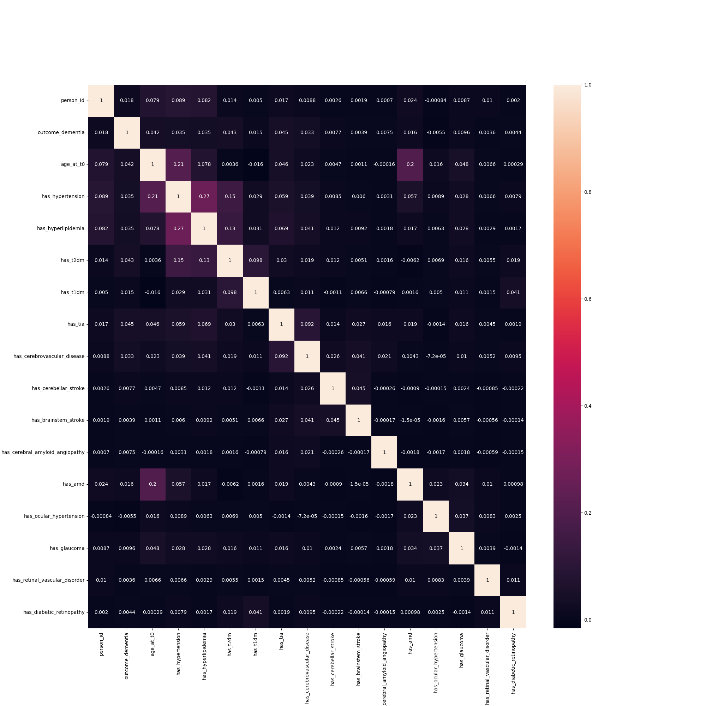
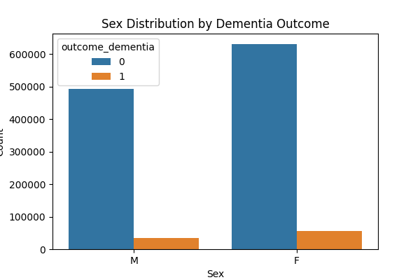
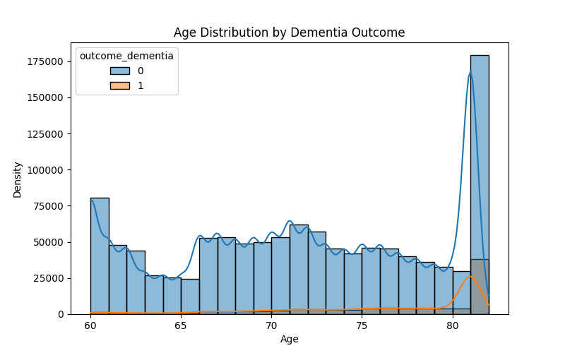
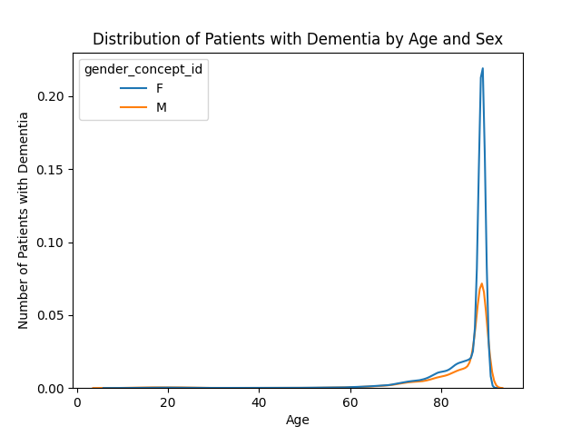

# OHDSI-2
## Discovery of biomarkers for the detection of vascular dementia
### Team lead:
Ryan Webb, MS in Data Science Candidate, Roux Institute,
Northeastern University, webb.ry@northeastern.edu

### Team Members:
Erin Pryor, MS in Data Science Candidate, Roux Institute,
Northeastern University, pryor.e@northeastern.edu

### Stakeholder
Christine Lary, PhD, Research Associate Professor, Roux Institute, Northeastern University, c.lary@northeastern.edu

### Project Description
#### Original:
In collaboration with investigators from the Jackson Laboratory, we have become interested in vascular contributions to cognitive impairment and dementia (VCID). Specifically, we are interested in identifying variables that predict all-cause dementia or vascular dementia. Predictors of interest include plasma biomarkers for metabolic syndrome (MetS) (HDL and LDL), emerging biomarkers for VCID (VEGF, PDGFRB, PLGF), inflammation markers (IL1, IL6, IL10), and neurodegeneration markers (amyloid, p-tau217, NFL, GFAP). We are also interested in age, genetics (APOE and MTHFR genotypes), physical activity, and diagnosis of metabolic syndrome. Availability of retinal scans would be helpful (fundus images and fluorescein angiography). We would also like to detect uncontrolled diabetes, known cerebrovascular disease, a diagnosis of dementia, or a positive diagnosis for common eye diseases (e.g., diabetic retinopathy, glaucoma, or age-related macular degeneration). Many of these may not be available, but for those that are available, building a prediction model for incident dementia or vascular dementia given these variables would be helpful as preliminary data. It would also be helpful as a process measure to record how often these predictors occur in the electronic health record.
#### Updated Description:
Given the nature of billable claims data in the OHDSI dataset and our progress so far, we aim to deliver 6 items:
1. **An epidemiological dementia cohort with descriptive statistics**. In line with the nature of epidemiological study design, this cohort is defined by eligible admission given any hospital visit at 60 years of age or older, with at least 1 year of clinical records preceding that visit and 3 years afterwards. The year before the inclusion visit (T0) is our "lookback" window, used to observe clinical diagnoses that could be identified as risk factors for dementia. The 3 year follow-up period is the window in which we are looking for a dementia diagnosis to classify the eligible patients in OHDSI as patients with dementia or "healthy" control subjects.
2. **Documentation** describing how the cohort is built. This is outlined in the "Study Design" section of this file.
3. **Statistically significant diagnostic criteria** to consider as features in a classification model. These were identified using a chi-squared test.
4. **Published classification models** that we can use as a benchmark against our own models and further research.
5. **Preliminary modeling** to indicate baseline performance for future teams that carry this research forward.
6. **A reproducible framework** that can be used for similar epidemiological studies in the OHDSI database. This will allow research teams to hit the ground running faster, build a cohort, and jump straight to EDA and modeling.

### Accessing OHDSI

The OHDSI Lab admin has very thorough documentation, and we've created this [Quickstart Guide](ohdsi_setup.md).

### Building a Cohort in NEU's OHDSI Lab
Within IQVIA's PharMetrics Plus data, we have access to billable claims data, which limits us to diagnoses in the scope of this study.

**To replicate the epidemiological cohort for dementia described below:**

- Copy and run the [cohort.sql](src/cohort.sql) file in DBeaver. This will generate the exact same cohort (we ingest data for all eligible participants) we use in under 10 minutes.

**To access this cohort in your WorkSpaces account:**

- Create a src folder with the following:
  - A credentials.py file
    - The example below demonstrates how to reference your credentials when connecting to DBeaver.
    - Ensure this is included in a .gitignore file. Do not push your credentials to GitHub!
  - A file connecting to your cohort for analysis
    - Import your dataframe with the example connection below.

`credentials.py`
```
'''
Northeastern will provide the user with:
- Host/Instance
- Port
- Database
- Amazon Redshift Username: from your OHDSI Lab workspace login details email
- Amazon Redshift Password: from your - OHDSI Lab workspace login details email (you have the option to save your password locally to avoid retyping each time)
- Amazon Redshift Schema: this will be provided as a value formatted like work_lastname_firstnameNumber
'''
#DO NOT PUSH THIS TO GITHUB!!!!! 
HOST = "copy_host_value"

PORT = redshift_port

DATABASE = "database name"

USER = "your_username"

PASSWORD = "your_password"

SCHEMA = "your_schema"
```

`cohort_conn.py`
```
import redshift_connector
import credentials # This imports your credentials file

connection = redshift_connector.connect(
     host=credentials.HOST,
     port=credentials.PORT,
     database=credentials.DATABASE,
     user=credentials.USER,
     password=credentials.PASSWORD)

cursor = connection.cursor()
cursor.execute(f'''SELECT * FROM {credentials.SCHEMA}.cohort_features''')
df = pd.DataFrame(cursor.fetchall(), columns=[d[0] for d in cursor.description])
```

### Study Design

The current cohort design ingests data from all eligible participants in the OHDSI database. The eligibility window, target features, and predictive diagnoses of interest can all be adjusted such that this cohort design could be reproduced for any epidemiological cohort study.

| Field | Detail | 
|-------|--------|
|Type | Epidemiological cohort study|
|Data source | OMOP Common Data Model (OMOP CDM v5.3)|
|Schema | omop_cdm_53_pmtx_202203 |
|Data type | Claims-based |
|Date range | January 2017 – June 2022 (~5.5 years)|

**T0:** First clinical visit (any type) on or after age 60, with 12 months of prior observation and 3 years of follow-up observation.

**Lookback window:** 12 months before T0. All predictor features are extracted in this timeframe.

**Outcome window:** 3 years after T0. Incident dementia diagnosis assessed within those 3 years.

#### Inclusion Criteria
|Criterion|Detail|
|---------|------|
|Age at T0 ≥ 60|Calculated as calendar year of T0 minus birth year|
|First clinical encounter|T0 = first visit (any type) on or after age 60|
|12 months observation before T0|Any observation period covering [T0 − 12mo, T0]|
|3 years observation after T0|Any observation period extending to T0 + 3 years|
|No dementia before T0|No dementia or impaired cognition code at or before T0 (incident dementia only)|

#### Outcome Definition
|Outcome|Definition|
|-------|----------|
|Incident dementia (1)|First dementia diagnosis occurring within [T0, T0 + 3 years]|
|Dementia-free (0)|No dementia diagnosis at any point through T0 + 3 years|

Dementia was defined using CONCEPT_ANCESTOR values from two top-level concepts:

- [4182210 — Dementia](dementia_diagnoses.md)
- [443432 — Impaired cognition](ic_diagnoses.md) (included to capture ADRD-related diagnoses and prevent outcome leakage)

#### Cohort Size and Incidence
All eligible patients meeting inclusion criteria are included initially. Sex and age are retained as model features rather than matching variables.

**Observed incidence:** 90,682 cases out of 1,214,708 eligible patients (~7.5%).

**Incidence > 5%:** Controls are not downsampled using stratified random sampling to match the age and sex distribution of cases. [cohort.sql](cohort.sql) specifies how to do this and would yield a balanced cohort of 181,364 total individuals.

#### Control Sampling Targets (matched to case distribution)
|Sex|Age Stratum|Cases|Controls Sampled|
|---|-----------|-----|----------------|
|F|60-69|7,929|7,929|
|F|70-79|19,996|19,996|
|F|80-89|27,653|27,653|
|M|60-69|5,668|5,668|
|M|70-79|15,109|15,109|
|M|80-89|14,327|14,327|
|Total||90,682|90,682|

*Note: 90+ age stratum excluded from controls as no cases are present in this stratum.*

#### Feature Set
All features extracted from the lookback window ([T0 − 12 months, T0]) only. For further research within OHDSI, concept ideas could be added/removed from [cohort.sql](cohort.sql) to adjust the features in the model. 

This can be done by adding the following in the ```CREATE TABLE cohort_features``` call. Similarly, irrelevant features could be removed by deleting such clauses, although that could be done with Python as well.

```
MAX(CASE WHEN co.condition_concept_id = chosen_concept_id_here  THEN 1 ELSE 0 END)
        AS chosen_concept_name_here,
```

#### Demographics
|Feature|Type|
|-------|----|
|Age at T0|Continuous|
|Sex|Binary (M/F)|

#### Cardiometabolic
|Feature|Concept ID|Type|
|-------|----------|----|
|Essential hypertension|320128|Binary|
|Hyperlipidemia|432867|Binary|
|Type 2 diabetes mellitus|201826|Binary|
|Type 1 diabetes mellitus|201254|Binary|

#### Cerebrovascular
|Feature|Concept ID|Type|
|-------|----------|----|
|Transient cerebral ischemia (TIA)|373503|Binary|
|Cerebrovascular disease|381591|Binary|
|Cerebellar stroke syndrome|4111711|Binary|
|Brainstem stroke syndrome|4111710|Binary|
|Cerebral amyloid angiopathy|4045749|Binary|

#### Ophthalmic
|Feature|Concept ID|Type|
|-------|----------|----|
|AMD (dry or wet)|372629, 376966|Binary|
|Ocular hypertension|381290|Binary|
|Glaucoma|437541|Binary|
|Retinal vascular disorder|434337|Binary|
|Diabetic retinopathy|45763583, 4255401, 4252356|Binary|

### Preliminary Findings 
#### Methodology
Using the epidimilogical cohort you are able to use [get_conditions.sql](src/get_conditions.sql) to link your people_id to any unique condition a patient would have exhibited before T0.  From this table you are able to run chi square testing to find diagnoises that occured more significnatly in patients with the targeted contidition ID (Dementia for this cohort).  Using [find_condition.py](src/find_conditions.py) This will loop through all conditions and run a chi-square test on them, outputting conditions.csv, significant_condtions.csv, which has the conditions where the p value is <.05 and sig_adjust.csv which has the adjusted p value taking into account the amount of variables there are. This takes a bit of time to run as there are over 10,000 conditions. 
Find Conditions produces 3 CSV files 

* [Conditions.csv](/conditions.csv) This csv contains all conditions that are explored along with their chi square value and the p values produced
* [Significant Conditions](/significant_conditions.csv) This csv contains only coniditions with a p value under .05, and therefore are considered statistically significant
* [Adjusted P Value](/sig_adjust.csv) This csv only contains an adjusted p value of under .05. This is used to correct the amount of possible false positive rates with multiple testing. 

#### Findings

Feature|Concept ID|Adjusted p value|
|-------|----------|----|
|Chronic Diastolic heart failure|40479576|3.36e-284|
|Tear film Insufficiency|378427|4.89e-234|
|Primary open angle glaucoma|435262|2.87e-223|
|Carotid artery obstruction|4288310|3.41e-207|
|Bradycardia|4169095|2.97e-182|
|Peripheral Venous Insufficiency|321596|1.32e-170|

We can see the discrepcies in these conditions in the cross tab tables

```
Chronic diastolic heart failure

outcome_dementia        0      1      All
has_condition
0.0               1110514  88305  1198819
1.0                 13512   2377    15889
All               1124026  90682  1214708
```

```
Tear Film Insufficiency

outcome_dementia        0      1      All
has_condition
0.0               1028285  80054  1108339
1.0                 95741  10628   106369
All               1124026  90682  1214708
```

```
Primary Open Angle Glaucoma

outcome_dementia        0      1      All
has_condition
0.0               1068285  83969  1152254
1.0                 55741   6713    62454
```

```
Carotid Artery Obstruction

outcome_dementia        0      1      All
has_condition
0.0               1097959  87087  1185046
1.0                 26067   3595    29662
All               1124026  90682  1214708
``` 

```
Bradycardia

outcome_dementia        0      1      All
has_condition
0.0               1098739  87265  1186004
1.0                 25287   3417    28704
All               1124026  90682  1214708
```

```
Peripheral Venous Insufficiency

outcome_dementia        0      1      All
has_condition
0.0               1105121  87998  1193119
1.0                 18905   2684    21589
All               1124026  90682  1214708
```

While there are many other conditions, these had high significance as well as literature to confirm these findings while being in the same vein as the types of conditions that were of interest to the stakeholder

#### EDA
The following figures and findings can be reproduced with the [eda_figs](src/eda_figs.py) file.

The features appear to be largely uncorrelated with each other and incident dementia.

`Feature Correlation Heatmap`


There are more females () than males that met eligibility criteria in our cohort for the control and dementia populations.

`Countplot of Male and Female Patients`

|Sex|Incident Dementia|Count|
|-|-|-|
|F|0|630961|
|F|1|55578|
|M|0|493064|
|M|1|35104|

Looking at ages, there is relatively uniform distribution for age and age based on sex for patients without incident dementia, whereas the age of patients with dementia is left skewed. The older an individual, the higher the probability of incident dementia.

`Age Distributuion for people without dementia (0) and with dementia (1)`

`Age Distribution by Sex for people without dementia (0) and with dementia (1).`


The large spike at 81 years old is assumed by us to be an artifact of the OHDSI data due to birth year imputation. During exploratory analysis, an unexpected spike of ~213,000 patients at age 81 was observed in the cohort age distribution. Investigation revealed that 212,689 patients shared an identical birth year of 1937, compared to ~800 for neighboring birth years, with T0 dates clustering in early January 2018. This led us to believe that OHDSI had assigned a default birth year of 1937 to patients with unknown birth dates.

We attempted modeling the data by excluding these patients given their imputed age so that we could better attribute the true signal of age to incident dementia. This generally worsened models, likely given that many (or at least more) of these patients are diagnosed with dementia so we end up having 37,435 fewer patients with a diagnosis of dementia to train and test on.

|Age at T0|Dementia|No Dementia|Total|
|-|-|-|-|
|60|1571|80471|82042|
|61|959|47773|48732|
|62|946|44146|45092|
|63|671|26890|27561|
|64|735|25581|26316|
|65|772|24617|25389|
|66|1933|52772|54705|
|67|1897|53173|55070|
|68|1938|48729|50667|
|69|2175|49992|52167|
|70|2563|53366|55929|
|71|3216|61798|65014|
|72|3369|57374|60743|
|73|2956|45403|48359|
|74|3157|42121|45278|
|75|3759|45988|49747|
|76|4153|45628|49781|
|77|4089|40118|44207|
|78|4041|36369|40410|
|79|3802|32623|36425|
|80|3858|29998|33856|
|81|37435|176053|213488|
|82|687|3043|3730|

### Initial Modeling and Comparisons
#### Initial Models
Initial models were generated [in this file](src/baseline_classifier.py). Our pipeline involved an 80-20 train-test split with scaled numerical features given that we were dealing with binary traits compared to age which ranged from 60-80+. Due to a large class imbalance, we randomly under sampled patients without dementia, handling class imbalance as well as runtime challenges. We then used a randomized search cross-validation to tune hyperparameters for logistic regression, random forest, and XGBoost classifiers.

#### Published Models and Evaluation Metrics
We have reviewed published models in order to record benchmark metrics that we aim to match or improve upon by modeling this data. We provide baseline performance of a model on this data, although did not have time to exhaustively optimize a model in the Spring 2026 semester.

Comparisons between published models and our initial baseline models can be found [here](benchmark.md).

### Known Limitations
#### Short epidemiological/longitudinal window
Of 34,808,145 unique patients in this dataset, we are limited to a 5.5 year observation window between January 2017 and June 2022. In terms of longitudinal follow-up, this means that we are predicting the diagnosis of ADRD in a short window preceding diagnosis rather than many years before when preventative measures may be more useful. The average follow-up per patient was 16 months, with a median of 10 months, with 1,214,708 patients meeting all of our inclusion criteria.
#### Claims-based diagnosis coding
Many of the biomarkers we were initially planning to investigate do not have measurements. This makes the data less informative as it masks certain measurements (ex: rather than cholesterol measurements, we have indications that people do or do not have hypercholesterolemia).
#### Dementia prevalence and cohort matching
Sampling the entire OHDSI database, we are able to ensure that cohorts are reproducible between machines. If any subsampling is performed in the future, it is critical to document the seed or random state for reproducibility.

### Next Steps for the Lary Lab
This repository provides a launchpad for the Lary Lab to finalize modeling performance. We have provided a description of the OHDSI data, methodology for a reproducible cohort, modular details to include any number of diagnostic features in the model, and benchmark metrics for comparison. With further time spent on optimizing a model's performance on this data, compared with the benchmarks provided, the Lary Lab could feasibly publish their results (combined with other modeling and research efforts related to VCID). To optimize the model, we recommend spending greater time on feature selection and considering some heavier computational methods (more thorough grid search CV). Our hope is that this body of work accelerates modeling efforts for the Lary Lab and any other research teams at Northeastern University seeking to conduct a retrospective epidemiological study using OHDSI.

### References
- [The Book of OHDSI](https://ohdsi.github.io/TheBookOfOhdsi/)

- [OMOP CDM v5.4 Schema & Table Details](https://ohdsi.github.io/CommonDataModel/cdm54.html)

- [Risk score for the prediction of dementia risk in 20 years among middle aged people: a longitudinal, population-based study
](https://pubmed.ncbi.nlm.nih.gov/16914401/)

- [External Validation of the eRADAR Risk Score for Detecting Undiagnosed Dementia in Two Real-World Healthcare Systems
](https://pubmed.ncbi.nlm.nih.gov/35906516/)

- [Early prediction of Alzheimer’s disease and related dementias using real-world electronic health records
](https://pmc.ncbi.nlm.nih.gov/articles/PMC10976442/)

- [Vascular Contributions to Cognitive Impairment and Dementia in the United States: Prevalence and Incidence: A Scientific Statement From the American Heart Association](https://www.ahajournals.org/doi/10.1161/STR.0000000000000494)