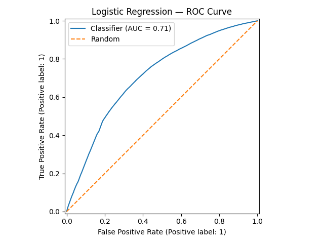
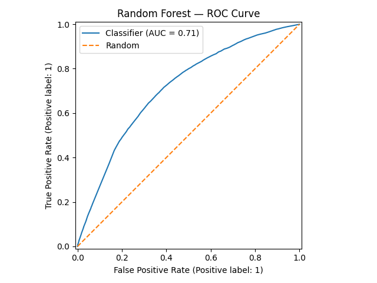
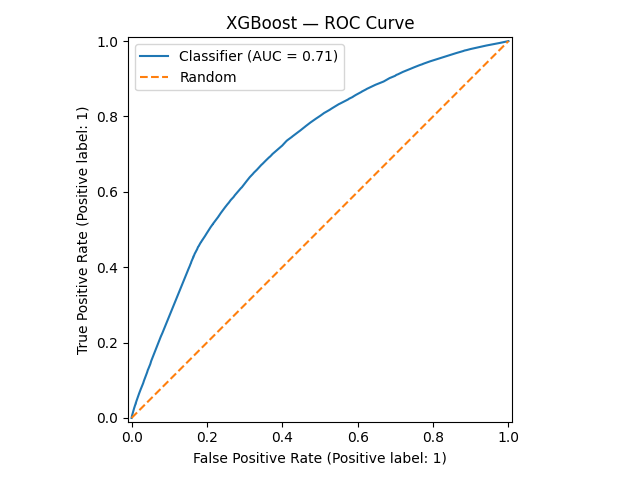
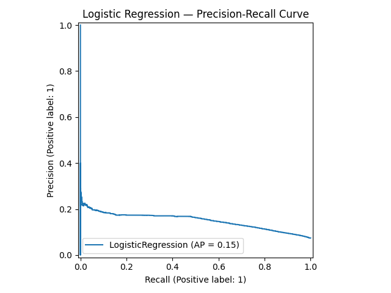
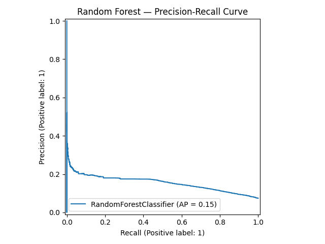
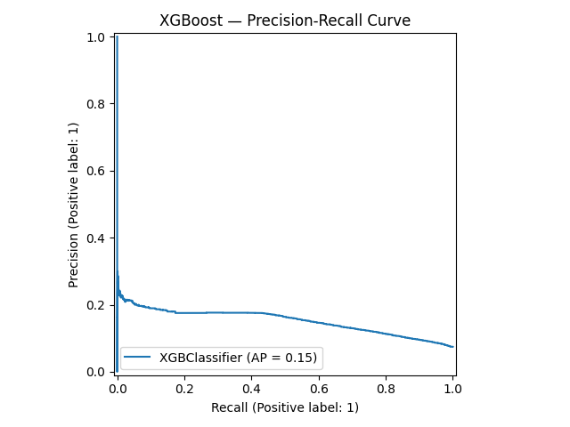

# Review of 3 Published Models for Performance Comparison

|Paper|Lookback window|Follow-up period|Incident dementia rate|Features|Modeling technique|
|-|-|-|-|-|-|
|Kivipelto et al. Lancet Neurol. 2006|Single midlife assessment (no formal lookback window)|20 years|4%|Age, sex, years of education, systolic blood pressure, BMI, total cholesterol, physical activity level, APOE ε4 status, follow-up time|Logistic regression; β coefficients summed into a weighted integer risk score (range 0–15)|
|Coley et al. J Gen Intern Med. 2023|2 years (prior EHR data)|12 months|11.1 per 1,000 person-years (KPWA); 4.6 per 1,000 person-years (UCSF)|EHR-derived: vital signs, diagnoses, medications, and healthcare utilization over the prior 2 years|LASSO-penalized logistic regression (eRADAR score); external validation study|
|Li et al. Alzheimers Dement. 2023|Not specified (EHR-based)|0, 1, 3, and 5 years prior to diagnosis|23,835 ADRD cases out of ~1,062,478 total patients (~2.2%)|Both knowledge-driven (established ADRD risk factors) and data-driven (ML-selected) EHR features including diagnoses, medications, labs, and procedures|Gradient boosting trees (GBT) and logistic regression (LR), with both knowledge-driven and data-driven feature selection; GBT + data-driven approach achieved best AUC|

### [Risk score for the prediction of dementia risk in 20 years among middle aged people: a longitudinal, population-based study](https://pubmed.ncbi.nlm.nih.gov/16914401/)

This study follows patients for 20 years with an incident dementia rate of 4%. AUC ranged between 0.70-0.80, sensitivity was 0.77, specificity was 0.63, and the negative predictive value (NPV) was 0.98.

Features included age, sex, years of education, systolic blood pressure, BMI, total cholesterol, physical activity level, *APOE* $\varepsilon$ 4 status, and follow-up time.

|AUC|Sensitivity|Specificity|NPV|
|-|-|-|-|
|0.70-0.80|0.77|0.63|0.98|

### [External Validation of the eRADAR Risk Score for Detecting Undiagnosed Dementia in Two Real-World Healthcare Systems](https://pubmed.ncbi.nlm.nih.gov/35906516/)
This study follows patients for 12-months after a 2-year lookback window to diagnose incident dementia in the following 12 months. Features include EHR data (including vital signs, diagnoses, medications, and utilization in the prior 2 years). eRADAR risk scores were generated to aid in the identification of the 50% of dementia patients that otherwise go undiagnosed.

Metrics at eRADAR dementia risk score cut-off at the 90th percentile:
|AUC|Sensitivity|Specificity|PPV|
|-|-|-|-|
|0.78-0.85|0.362-0.543|0.898-0.916|0.020-0.116|

### [Early prediction of Alzheimer’s disease and related dementias using real-world electronic health records](https://pmc.ncbi.nlm.nih.gov/articles/PMC10976442/)
#### Methodology takeaways
This study demonstrated that data-driven modeling/feature selection outperformed knowledge-driven feature selection. This indicates that ML approaches to ADRD diagnosis can aid clinicians in better predictive diagnostics. The researchers tested both gradient boosting trees and logistic regression models on these varying sets of features.

Knowledge-driven features from clinicians includes medical diagnoses of obesity, diabetes, hyperlipidemia, hypertension, heart disease, stroke, depression, anxiety, concussion, sleep disorders, periodontitis, smoking, and alcohol use; medication exposures, including nonsteroidal anti-inflammatory drugs (NSAIDs), statins, anticholinergics, hormone replacement therapies, antihypertensives, benzodiazepines, and proton pump inhibitors; the most recent vital signs and lab test results, including body mass index (BMI), systolic/diastolic blood pressure, total cholesterol, high-density lipoprotein, glucose, and hemoglobin A1C (HbA1c) in the observation period. The authors encoded diagnoses and medication histories as binary variables in the models. Measurements were categorized based on the reference normal range (e.g., abnormally low, normal, or abnormally high).

For the data-driven features, the authors used all variables captured by the EHRs, including demographic and behavioral variables, such as age, gender, race, ethnicity, marital status, and smoking status. They included all discrete diagnoses, all medications, and all procedure codes recorded in patients’ EHRs as categorical features. To address the sparsity of features, they grouped similar features.

We are especially interested in the 3-year prediction window given it offers a direct comparison to the cohort we have developed.

|Prediction Window (Years)|AUC|Sensitivity|Specificity|PPV|NPV|
|-|-|-|-|-|-|
|0|0.877-0.939|0.814-0.862|0.781-0.866|0.316-0.439|0.972-0.981|
|1|0.854-0.906|0.785-0.836|0.774-0.827|0.337-0.409|0.961-0.972|
|3|0.841-0.884|0.772-0.815|0.764-0.805|0.372-0.444|0.947-0.958|
|5|0.830-0.858|0.750-0.800|0.742-0.786|0.429-0.491|0.932-0.942|

### Our Cohort and Models
The cohort we have developed focuses on clinical diagnoses alone, as medications and procedures were not included in the initial scope of this project. They may be worth considering in future research by the Lary Lab. We also limited our feature set to diagnoses closely related to the measurements initially identified by the Lary Lab in addition to a few extra diagnoses that were significant in the chi-square test. It may be worthwhile to expand the scope of diagnoses included in this cohort. For feasibility and proof of concept, we limited the number of diagnoses given the large number of patients we have, time constraints, and available computational power.

Feature selection is one area of exploration we did not spend as much time on and would recommend future groups investigate.

### Model Performance Summary

| Metric | Logistic Regression | Random Forest | XGBoost |
|---|---|---|---|
| **Accuracy** | 0.6310 | 0.6281 | 0.6479 |
| **Precision** | 0.1311 | 0.1307 | 0.1342 |
| **Recall** | 0.7007 | 0.7045 | 0.6820 |
| **F1** | 0.2209 | 0.2205 | 0.2243 |
| **ROC-AUC** | 0.7119 | 0.7118 | 0.7132 |
| **Sensitivity (TPR)** | 0.7007 | 0.7045 | 0.6820 |
| **Specificity (TNR)** | 0.6254 | 0.6220 | 0.6451 |
| **NPV** | 0.9628 | 0.9631 | 0.9618 |
| **FNR** | 0.2993 | 0.2955 | 0.3180 |

### Confusion Matrices

| | Logistic Regression | Random Forest | XGBoost |
|---|---|---|---|
| **TN** | 140,584 | 139,819 | 145,031 |
| **FP** | 84,222 | 84,987 | 79,775 |
| **FN** | 5,429 | 5,360 | 5,767 |
| **TP** | 12,707 | 12,776 | 12,369 |

### Best Hyperparameters

| Parameter | Logistic Regression | Random Forest | XGBoost |
|---|---|---|---|
| `solver` | liblinear | — | — |
| `penalty` | l1 | — | — |
| `C` | 0.1 | — | — |
| `n_estimators` | — | 300 | 500 |
| `max_depth` | — | 10 | 3 |
| `min_samples_split` | — | 5 | — |
| `min_samples_leaf` | — | 5 | — |
| `max_features` | — | sqrt | — |
| `learning_rate` | — | — | 0.05 |
| `subsample` | — | — | 0.85 |
| `colsample_bytree` | — | — | 1.0 |
| `min_child_weight` | — | — | 5 |
| `gamma` | — | — | 0.1 |
| **CV F1** | 0.6734 | 0.6726 | 0.6677 |

#### Currently, this model generally underperforms what is available in the literature. That being said, we believe that more time spent on feature selection and finetuning the hyperparameters of these models could match or improve upon what is available in the literature.

#### ROC-AUC Curves

#### Precision-Recall Curves

### Modeling without 81 year olds
#### Removing individuals with the 1937 birth year imputation generally worsened model performance, so we will be leaving them in for now. This problem would benefit from further exploration going forward.

