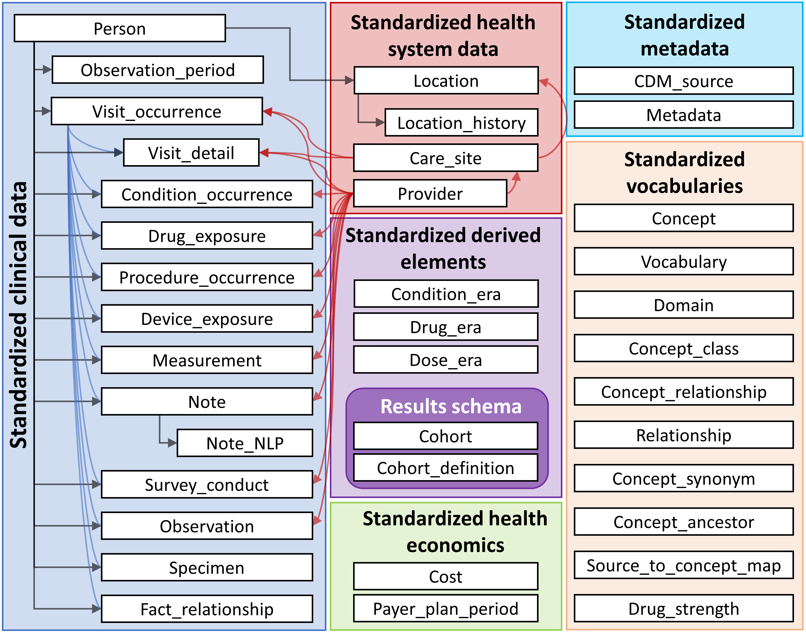
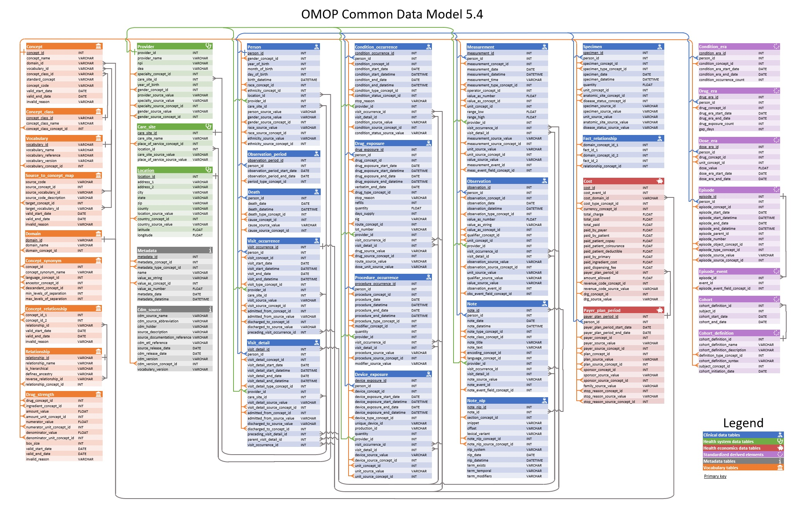

# OHDSI 

The OHDSI (Observational Health Data Sciences and Informatics) network is a global, open-science collaborative aimed at improving health outcomes through large scale analysis of real world observational health data. By standardizing disparate health records into a common data model (the OMOP CDM), OHDSI enables researchers across institutions and countries to run reproducible studies on hundreds of millions of patient records and claims data. Its goals include generating reliable evidence about disease natural history, treatment effectiveness, and safety. This  makes it a powerful resource for exploratory research like identifying conditions correlated with complex diagnoses such as dementia.  
[The Book Of OHDSI](https://ohdsi.github.io/TheBookOfOhdsi/)

## Common Data Model 

The OHDSI database stores millions of insurance claim records, one for every interaction a patient has had with the healthcare system meaning certain patients can have hundreds of records. Understanding how to extract meaningful insights from it requires untangling layers of relational data logic.

A subset of what the CDM Looks Like

The OMOP CDM

[OMOP CDM](https://ohdsi.github.io/CommonDataModel/cdm54erd.html)

This looks quite overwhelming so knowing where your information is stored and what information is needed is Crucial to working within the CDM

After serveral rounds of trial and error we narrowed our scope to the tables 

|Table Name|Column|
|-------|----------|
| concept_ancestor | ancestor_concept_id, descendant_concept_id |
| condition_occurrence| person_id, condition_concept_id, condition_start_date |
| person| person_id, gender_concept_id, year_of_birth|
| visit_occurrence| person_id, visit_start_date |
| observation_period| person_id, observation_period_start_date, observation_period_end_date |

